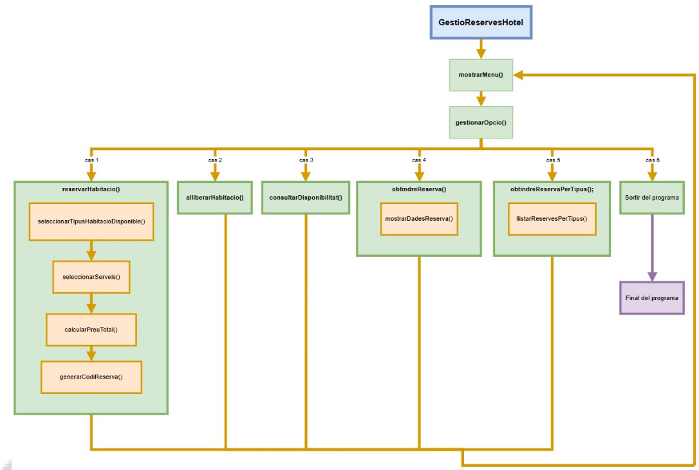

# Exercici d'Avaluació: Gestió de Reserves d'Hotel en Java

## 🎯 Objectiu
Implementar un sistema en **Java** que permeta gestionar les reserves d'un hotel amb diferents tipus d'habitacions i serveis addicionals. L'aplicació ha de permetre:

- Reservar habitacions.
- Alliberar habitacions.
- Consultar disponibilitat.
- Consultar dades d'una reserva.
- Consultar reserves per tipus d'habitació.

---

## 📂 Estructura del projecte

------------------------------------

## Índex

 1. Enunciat del problema
    1. Introducció
    2. Requisits generals
    3. Funcionalitats del sistema
    4. Consideracions tècniques

 2. Variables globals i mètodes a implementar
    1.  Variables globals
    2.   Mètodes
         1.    Mètode obtindreReservaPerTipus()
         2.    Mètode llistarReservesPerTipus()
         3.    Mètode seleccionarTipusHabitacioDisponible() 
         4.    Mètode seleccionarServeis()

3. Exemple d’execució del programa

## 1. Enunciat
### 1.1. Introducció

Has trobat treball com a desenvolupador/a en un prestigiós hotel de la ciutat. La gerència de l’hotel t’encarrega una tasca important: han detectat que el sistema manual que utilitzen per gestionar les reserves és poc eficient i causa errors freqüents.

El teu objectiu és crear un sistema informatitzat de gestió de reserves que simplifique i automatitze el procés. Aquest sistema ha de permetre gestionar les habitacions disponibles, fer reserves amb serveis addicionals, calcular el cost total amb IVA i consultar la informació necessària de manera ràpida i precisa.

Amb aquesta solució, l’hotel espera millorar l’experiència dels seus clients i optimitzar els processos interns.

### 1.2. Requisits generals

L’hotel disposa de 3 tipus d’habitacions: Estàndard, Suite i Deluxe, amb una disponibilitat inicial de 30, 20 i 10 habitacions respectivament.

**Preus per nit:**

- Estàndard: 50 €

- Suite: 100 €

- Deluxe: 150 €

**Serveis addicionals:**

- Esmorzar: 10 €

- Gimnàs: 15 €

- Spa: 20 €

- Piscina: 25 €

S’aplica un IVA del 21% al cost total.

### 1.3. Funcionalitats del sistema

1. **Reservar una habitació**

   - Mostrar disponibilitats i preus.

   - Seleccionar tipus d’habitació i comprovar-ne la disponibilitat.

   - Seleccionar serveis addicionals sense repetir.

   - Calcular el preu total amb IVA.

   - Generar un codi únic de 3 dígits.

   - Guardar la reserva.
     - Codi de la reserva
     - Tipus d'habitació
     - Cost total
     - Serveis addicionals

2. **Alliberar una habitació**

   - Introduir el codi de reserva.

   - Eliminar reserva i actualitzar disponibilitat.

3. **Consultar disponibilitat**

   - Mostrar habitacions lliures i ocupades per tipus.

4. **Consultar dades d’una reserva** 

   - Mostrar tipus d’habitació, cost total i serveis addicionals através del codi de la reserva.

5. **Consultar reserves per tipus**

   - Llistar totes les reserves associades a un tipus.

6. **Ixir**

### 1.4. Consideracions tècniques

- Ús de HashMap i ArrayList per a gestionar les reserves i la disponibilitat

- Codis de reserva únics.

- Validació d’entrades de l’usuari per a que no es produeixen valors fora dels límits.31

- Codi modular i comentat. A cada funció se li ha d'afegir una breu explicació del seu
funcionament. A les variables més importants també es pot comentar quina informació van a
emmagatzemar, en quin ordre (en cas de variables compostes), etc.

- Només es poden utilitzar els mètodes i estructures vistes a classe.

  ⚠️ <strong>Important:</strong> 
  
  - Per a la implementació del programa NO es podran usar aquells elements que no
s'hagen vist en classe (*).
- En l'apartat 2 apareixen les variables globals i els mètodes que s'han d'usar. No es
poden usar ni més ni menys que els que hi ha.

(*) **Nota**: En la documentació teòrica de les unitats didàctiques es troben llistats de mètodes de
determinades classes (String, Math, etc.). Aquests llistats són únicament una recopilació dels mètodes més
comuns i útils, però no representen la totalitat dels mètodes permesos. Es permet, per tant, usar mètodes
que no apareixen en la teoria, si es creu necessari
## 2. Variables globals i mètodes a implementar
### 2.1. Variables globals

El programa ha d’incloure:

- Capacitat inicial d’habitacions: 30 estàndard, 20 suite, 10 deluxe.

- Un únic objecte Scanner.

- Valor de l’IVA (21%).

- 5 HashMap:

#### HashMaps de consulta (no modifiquen contingut):

- Tipus d’habitació → preu i capacitat inicial.

- Serveis addicionals → preu.

#### HashMaps dinàmics (canvien en temps d'execució):

- Disponibilitat per tipus d’habitació.

- Informació de les reserves. Aquest serà l'element més important, ja que contindrà tota la informació rellevant de totes les reserves fetes

#### Estructura del HashMap de reserves:

`codiReserva → ArrayList<String>`

| Posició | Contingut           |
| ------- | ------------------- |
| 0       | Tipus d’habitació   |
| 1       | Preu total          |
| 2       | Servei addicional 1 |
| 3       | Servei addicional 2 |
| 4       | Servei addicional 3 |
| 5       | Servei addicional 4 |

Totes les variables globals han de ser `static`.

### 2.2. Mètodes

El programa ha d'implementar els següents mètodes (ni més ni menys)

`public static void main(String[] args)`

Bucle principal, menú i gestió de l’opció.

`static void inicialitzarPreus()`

Congura els preus de les habitacions, serveis addicionals i
disponibilitats inicials en estructures de dades adequades (HashMap).

`static void mostrarMenu()`

Mostra el menú principal amb les opcions disponibles per a l'usuari.

`static void gestionarOpcio(int opcio)`

Processa l’opció i crida al mètode adequat.

`static void reservarHabitacio()`

Gestiona tot el procés de reserva. Incloent la selecció del tipus
d'habitació, serveis addicionals, càlcul del preu total, i generació d'un codi de reserva únic

`static String seleccionarTipusHabitacio()`

Demana a l’usuari un tipus i retorna el String corresponent.

`static String seleccionarTipusHabitacioDisponible()`

Mostra la disponibilitat dels tipus d'habitacions i crida a eleccionarTipusHabitacio(). Si del tipus d'habitació seleccionat queden habitacions disponibles, el retorna. En cas contrari, retorna `null` .

`static ArrayList<String> seleccionarServeis()`

Permet a l'usuari triar serveis addicionals que vol afegir a la reserva. Els retorna en un ArrayList de String que tindrà entre 0 i 4 elements (serveis). Els serveis no es poden repetir.

`static float calcularPreuTotal(String tipus, ArrayList<String> serveis)`

Retorna el preu total incloent IVA.

`static int generarCodiReserva()`

Genera un codi de 3 dígits no repetit.

`static void alliberarHabitacio()`

Allibera una reserva pel seu codi. Actualitza la disponibilitat del tipus d'habitació corresponent.

`static void consultarDisponibilitat()`

Mostra habitacions lliures i ocupades.

`static void llistarReservesPerTipus(int[] codis, String tipus)`

Funció recursiva. Mostra les reserves d’un tipus especicat per l'usuari.

`static void obtindreReserva()`

Consulta les dades d’una reserva concreta através del codi.

`static void obtindreReservaPerTipus()`

Mostra totes les reserves d’un tipus.

`static void mostrarDadesReserva(int codi)`

Mostra els detalls complets d’una reserva.

* Diagrama de  funcionament de les cridades a les funcions. Només apareixen les principals.
Anem a vore el funcionament d'alguns mètodes més en profunditat:

#### 2.2.1. Mètode obtindreReservaPerTipus()
Aquest mètode crida primer al mètode seleccionarTipusHabitació() i emmagatzema el resultat. Després crida al mètode llistarReservesPerTipus() amb dos paràmetres: un array amb tots els codis de les reserves i el tipus d'habitació seleccionat.

#### 2.2.2. Mètode llistarReservesPerTipus()
Aquesta és una funció recursiva que mostrarà (mitjançant el mètode mostrarDadesReserva()) tots els
detalls de les habitacions d'un tipus. El seu funcionament és el següent:
- Primer comprovarà el primer codi del vector de codis que rep (la posició 0), i cridarà al mètode
mostrarDadesReserva() només si aquest primer codi pertany a una habitació del tipus desitjat.
- Després crearà un nou vector igual al de codis però amb la posició 0 el·liminada, és a dir, es crearà un
nou vector de tamany una unitat menor que el de codis al qual se li assignaran els mateixos valors a
excepció del de la posició 0. A continuació un exemple:

| **Vector codis original** ||||||
|---------------------------|------|------|------|------|------|
| **Codis:**                | 123  | 456  | 789  | 876  | 543  |
| **Posicions:**            | 0    | 1    | 2    | 3    | 4    |

| **Nou vector de codis** |||||
|--------------------------|------|------|------|------|
| **Codis:**               | 456  | 789  | 876  | 543  |
| **Posicions:**           | 0    | 1    | 2    | 3    |

Per a fer-ho utilitzarem la següent instrucció:

`System.arraycopy(codis, 1, newCodis, 0, newCodis.length);`

on codis és el vector original i newCodis és el nou vector de menor tamany, prèviament declarat

- Finalment, es cridarà a la funció llistarReservesPerTipus() amb el nou vector i el mateix tipus
d'habitació.

#### 2.2.4. Mètode seleccionarServeis()
Aquest mètode emmagatzema en un ArrayList els serveis que seleccionarà l'usuari. Es podran seleccionar,
sense repetir, qualsevol nombre de serveis (màxim els 4 que hi ha) o no introduir ningun. Una vegada ja
s'haja acabat el procés de selecció de serveis addicionals, es retornarà l'ArrayList.

## Exemple d'execució del programa

### 📌 MENÚ PRINCIPAL (vist en totes les iteracions)
===== MENÚ PRINCIPAL =====
1. Reservar una habitació
2. Alliberar una habitació
3. Consultar disponibilitat
4. Consultar dades d'una reserva
5. Consultar reserves per tipus
6. Ixir

Seleccione una opció: 

## 🟦 Exemple d’Opció 1 – Reservar una habitació

===== RESERVAR HABITACIÓ =====

Tipus d’habitació disponibles:
1. Estàndard - 30 disponibles - 50€
2. Suite      - 20 disponibles - 100€
3. Deluxe     - 10 disponibles - 150€

Seleccione tipus d’habitació: 2

Serveis addicionals (0-4):

0. Finalitzar 
1. Esmorzar (10€)
2. Gimnàs   (15€)
3. Spa      (20€)
4. Piscina  (25€)

Vol afegir un servei? (s/n): s
Seleccione servei: 1

Servei afegit: Esmorzar

Vol afegir un servei? (s/n): s

Seleccione servei: 4

Servei afegit: Piscina

Vol afegir un servei? (s/n): n

Calculem el total...

Preu habitació: 100€

Serveis: Esmorzar (10€), Piscina (25€)

Subtotal: 135€

IVA (21%): 28.35€

TOTAL: 163.35€

Reserva creada amb èxit!

Codi de reserva: 482

(menú)

## 🟩 2. Exemple d’Opció 2 – Alliberar una habitació

===== ALLIBERAR HABITACIÓ =====
Introdueix el codi de reserva: 482

Reserva trobada!

Habitació alliberada correctament.

Disponibilitat actualitzada.

(menú)

## 🟨 3. Exemple d’Opció 3 – Consultar disponibilitat

===== DISPONIBILITAT D'HABITACIONS =====

Tipus    |   Lliures  | Ocupades
---------|------------|------------
Estàndard  |   29     |   1
Suite       |  19      |  1
Deluxe       | 10       | 0

(menú)

## 🟪 4. Exemple d’Opció 4 – Consultar dades d'una reserva

===== CONSULTAR RESERVA =====
Introdueix el codi de reserva: 482

Dades de la reserva:
- Tipus d'habitació: Suite
- Cost total: 163.35€
- Serveis addicionals:
   * Esmorzar
   * Piscina

(si el codi no existeix)

No s'ha trobat cap reserva amb aquest codi.

(menú)

## 🟧 5. Exemple d’Opció 5 – Consultar reserves per tipus

===== CONSULTAR RESERVES PER TIPUS =====

Seleccione tipus:
1. Estàndard
2. Suite
3. Deluxe

Opció: 2

Reserves del tipus "Suite":

Codi: 482
- Tipus d'habitació: Suite
- Cost total: 163.35€
- Serveis:
   * Esmorzar
   * Piscina

(No hi ha més reserves d’aquest tipus.)

## 🟥 6. Exemple d’Opció 6 – Ixir
Eixint del sistema...

Gràcies per utilitzar el gestor de reserves!

---
# Avaluació

Este projecte inclou **tests automàtics** que s’executaran en GitHub Classroom per a avaluar la teua solució.

## Programació sobre el fitxer **app.java**

> **📌 Important:** En el fitxer `app.java` ubicat en `src/main/java/com/hotel/`, cal modificar **tots els punts on aparega la paraula TODO**. Cada TODO indica una part del codi que l'estudiant ha d'implementar segons les especificacions descrites en aquest document. No s'ha d'afegir cap mètode nou ni eliminar-ne cap; únicament completar els espais senyalats.

## ✅ Com funciona l’avaluació automàtica?
- Els tests comproven diferents funcionalitats del sistema (menú, reserves, càlcul de preus, etc.).
- Cada test té una puntuació assignada. Si passa, sumes eixos punts.

## 🔍 Com veure els resultats?
1. Ves al teu repositori en GitHub.
2. Fes clic en la pestanya **Actions**.
3. Busca el workflow anomenat **Autograding**.
4. Fes clic en l’última execució per a veure quins tests han passat i quins han fallat.

## ⚠️ Si falla un test:
- Llig el missatge d’error en el log de GitHub Actions.
- Corregeix el teu codi i torna a fer **commit + push**.
- El sistema tornarà a executar els tests automàticament.

## 🧪 Tests inclosos:
- Menú principal i opcions.
- Inicialització de preus i disponibilitat.
- Reserves i alliberament d’habitacions.
- Càlcul de preus amb IVA.
- Consultes i llistats de reserves.

**Sort i revisa sempre els resultats en GitHub Actions!**

